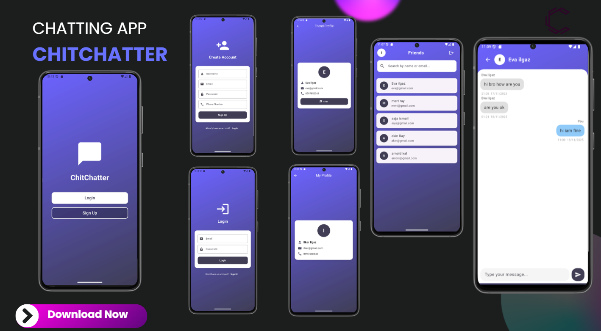

# 💬 ChitChatter App

A modern real-time chat application built with **Flutter**, **Firebase Authentication**, and **Cloud Firestore**.  
The app allows users to sign up, log in, browse registered users, chat in real time, and view their profile.

---

## 🚀 Features

### 🔐 Authentication
- Email & Password Sign-Up
- Prevents duplicate:
  - ❌ Email already exists
  - ❌ Phone number already registered
- Login / Logout functionality
- Stores user data securely in Firestore

---

### 🏠 Home Screen
- Displays a list of all registered users (except the logged-in one)
- Shows:
  - Avatar (first letter of user’s name)
  - Name
  - Email
- Tap another user → opens **Chat Screen**
- Tap your own avatar → opens **Profile Screen**

---

### 👤 Profile Screen
- Displays:
  - Name
  - Email
  - Phone number
- Gradient background with clean UI
- Accessible from the top bar avatar

---

### 💬 Chat Screen
- Real-time messaging powered by Firestore
- Clean chat bubble UI
- Supports:
  - Instant message sending
  - Auto-scroll to the latest message
---

## 📱 Screens Preview

Below is a preview from the app (replace with your actual image):

